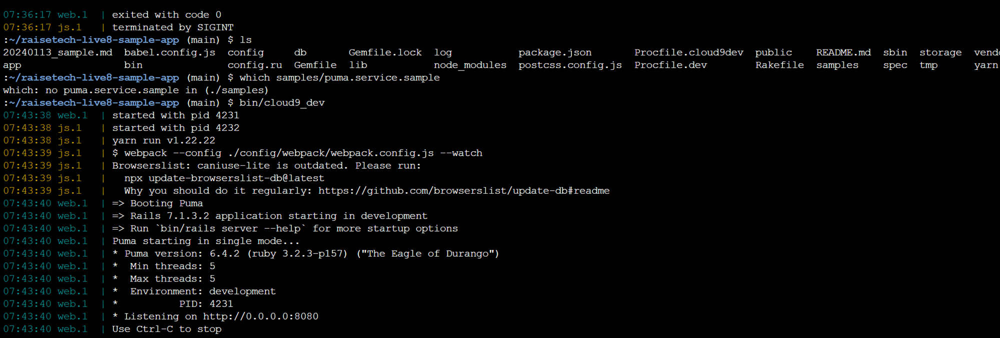
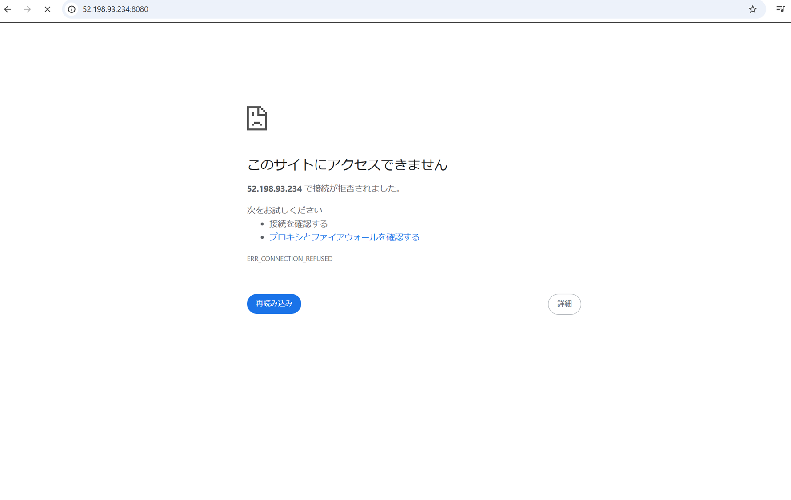
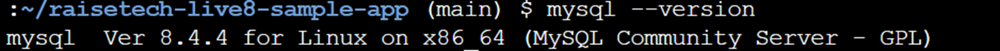
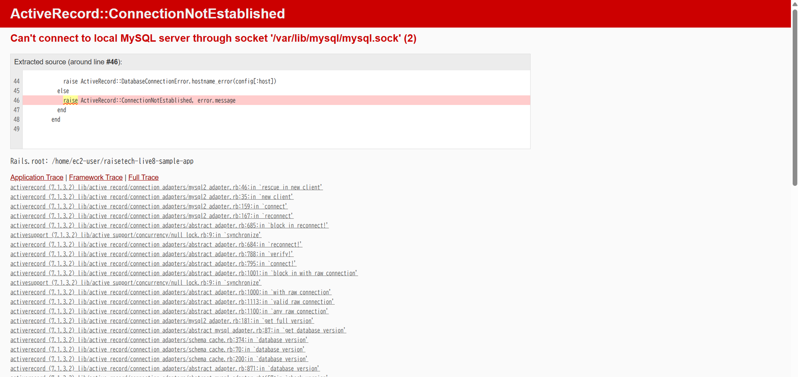
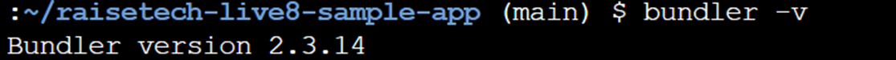

# 第3回課題
## 1.APサーバーについて調べる
### AP サーバーの名前とバージョン
- Puma 6.4.2 
### AP サーバーを終了させた場合、引き続きアクセスできますか
- できない 
## 2.DBサーバーについて調べる
### DB サーバー（DB エンジン）の名前とバージョン
- Mysql 8.4.4 
### DB サーバーを終了させた場合、引き続きアクセスできますか
- できない 
### Rails の構成管理ツールの名前は何でしたか
- Bundler 
## 今回の課題から学んだこと、感じたこと
- 今までで一番時間がかかった課題でした。調べながら実施できたので今までよりも力はついたと思います。調べる中でエラーログをみてあたりをつけることをしましたが、まだ時間はかかるので慣れていくようにしていきたいです。